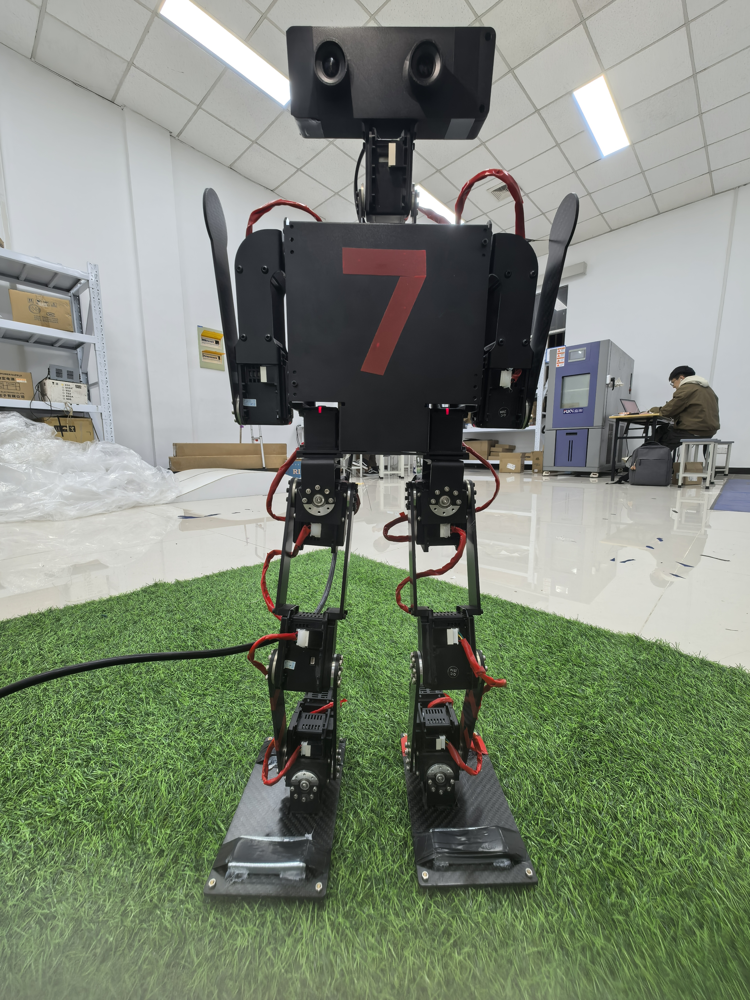

# SEU-UniRobot

东南大学 RoboCup KidSize 人形机器人自主控制器 (V2.1)

C++11/CUDA 项目，运行于 NVIDIA Jetson Orin NX，用于自主人形足球机器人。

## Authors
- YDF

## 代码框架

### 整体架构

```
main.cpp -> Player("maxwell") -> OPTS->init() -> CONF->init() -> ROBOT->init() -> Player::init()
```

核心采用 **单例 + 观察者(发布/订阅) + 有限状态机(FSM)** 模式：

- **单例**: Configuration (CONF), Options (OPTS), WorldModel (WM), Vision (VISION), WalkEngine (WE), ScanEngine (SE), ActionEngine (AE), LedEngine (LE), Localization (SL), Robot (ROBOT)
- **观察者**: 传感器 (Camera, IMU, Motor, Button, GameCtrl, Hear) 为 Publisher；WorldModel, Vision, WalkEngine 为 Subscriber
- **FSM**: Player 行为由状态机驱动：READY -> GETUP -> SEARCH_BALL -> GOTO_BALL -> KICK_BALL -> DRIBBLE -> SL
- **Task**: 每个思考周期产生 Task (WalkTask, ActionTask, LookTask, GcretTask, SayTask, LedTask)，依次执行

### 数据流

```
摄像头采集 -> Vision 流水线 (GPU 色彩转换/缩放/去畸变/letterbox + TensorRT YOLOv8 推理)
  -> 检测结果更新 WorldModel -> Player FSM 决策 -> Task 驱动各 Engine -> 电机传感器发送 Dynamixel 关节指令
```

### 主要子系统

| 子系统 | 路径 | 功能 |
|---|---|---|
| Player | `src/controller/player/` | 核心调度、FSM、思考循环 |
| Vision | `src/controller/player/vision/` | YOLOv8 TensorRT 10 检测器、GPU 图像流水线 |
| Sensors | `src/controller/player/sensor/` | 摄像头 (V4L2/ZED)、IMU、电机、GameCtrl、按键、通信 |
| Engines | `src/controller/player/engine/` | 步态 (IKWalk)、动作、扫描、LED |
| Localization | `src/controller/player/localization/` | 卡尔曼滤波自定位 |
| WorldModel | `src/controller/player/core/worldmodel.hpp` | 全局世界状态单例 |
| Server | `src/controller/player/server/` | TCP 调试服务器 (Boost.Asio) |
| Debug Tools | `src/tools/debuger/` | Qt5 GUI：图像监控、动作调试、步态遥控等 (仅 x86_64) |

### 配置文件

所有行为通过 `src/data/` 下的 JSON 配置驱动：
- `config.conf` -- 主配置 (队伍信息、策略站位、阈值、每名球员设置)
- `model/robot.conf` -- 运动学树、关节层级、骨骼长度
- `action/*.conf` -- 步态参数、动作序列、扫描配置、关节偏移
- `algorithm/*.engine` -- TensorRT 引擎文件 (球/门柱检测)

### 线程模型

每个主要组件运行在独立线程：摄像头采集、视觉处理、步态引擎、扫描引擎、动作引擎、LED 引擎、电机通信、IMU 轮询、Game Controller 监听、TCP 服务器、手动控制输入。

## 环境依赖

### 构建工具
- cmake >= 3.12
- gcc / g++ (支持 C++11)
- nvcc (CUDA Toolkit)

### C++ 库

| 依赖 | 最低版本 | 安装 |
|---|---|---|
| CUDA | >= 9.0 | 通过 JetPack 安装 |
| cuDNN | >= 7.0 | 通过 JetPack 或手动安装 |
| TensorRT | -- | 预装于 `/usr/local/tensorrt` |
| OpenCV | >= 3.3.1 | 通过 JetPack 或手动安装 |
| Eigen3 | -- | `sudo apt-get install libeigen3-dev` |
| Boost | -- | `sudo apt-get install libboost-all-dev` (system, program_options, asio, filesystem) |
| OpenGL/GLUT/GLU | -- | `sudo apt-get install freeglut3-dev` |
| libv4l | -- | `sudo apt-get install libv4l-dev` |
| ZED SDK | (可选) | 自动检测 `/usr/local/zed/`，未安装则跳过 |

### Python3 库 (部署脚本)

```bash
pip3 install paramiko transitions ssh2-python
```

### 可选工具
- Qt5 -- 仅 x86_64 调试工具需要
- astyle -- 代码格式化 (`sudo apt-get install astyle`)

## 编译与运行

### x86_64 本机编译 (开发/调试)

```bash
python3 x86_64-build.py
# 产物: bin/x86_64/controller
```

### aarch64 交叉编译 (部署到 Jetson Orin NX)

```bash
python3 aarch64-build.py
# 产物: bin/aarch64/controller
```

### 部署到机器人 (编译 + SSH 上传 + 运行)

```bash
python3 src/scripts/start_robot.py
```

### 运行参数

运行时加 `-h` 查看所有选项：
`-p` 球员ID, `-d` 调试模式, `-c` 摄像头, `-r` 机器人, `-g` GameCtrl, `-s` 通信, `-k` 踢球模式, `-m` 远程控制, `-f` 控制标志 (0=自动, 1=键盘), `-i` 录像

## 推荐环境

- **操作系统**: Ubuntu 20.04+ / JetPack 5.x+
- **IDE**: VS Code (C++/Python 插件) 或 CLion

## 机器人示意图

<p align="center">
  
</p>
